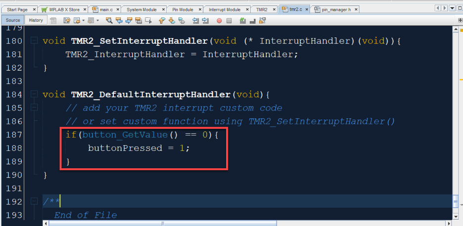
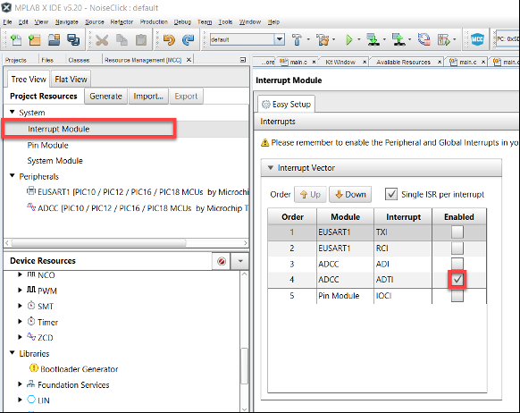

<!-- Please do not change this html logo with link -->

# Getting started with [Future Electronics 8 Ball development board](https://www.futureelectronics.com/resources/technical-resources/microchip-future-8-ball/) an 8-bit PIC® design is as easy as 1-2-3.
Using the Future Electronics 8 Ball development board, you will rapidly bring your 8-bit design to life with low-power analog, temperature sensors and an OLED display. 

 

This development board sets the ball in motion for any of the following applications:
- IoT sensor end nodes
- Motor control
- Industrial processing control
- Medical
- Home appliances
- Touch sensing
- Automotive systems
- Long-life, battery-powered devices
- Wearable electronics

Get yours here https://www.futureelectronics.com/resources/technical-resources/microchip-future-8-ball/

## Software Used

- MPLAB® X IDE 5.40 or newer [(microchip.com/mplab/mplab-x-ide)](http://www.microchip.com/mplab/mplab-x-ide)
- MPLAB® XC8 2.20 or a newer compiler [(microchip.com/mplab/compilers)](http://www.microchip.com/mplab/compilers)
- MPLAB® Code Configurator (MCC) 4.0.1 or newer [(microchip.com/mplab/mplab-code-configurator)](https://www.microchip.com/mplab/mplab-code-configurator)
- MPLAB® Code Configurator (MCC) Device Libraries AVR® MCUs [(microchip.com/mplab/mplab-code-configurator)](https://www.microchip.com/mplab/mplab-code-configurator)
- Microchip PIC Series Device Support (PIC16F1xxxx_DFP) or newer [(packs.download.microchip.com/)](https://packs.download.microchip.com/)

## Hardware Used

- PIC16F18446 Curiosity Nano Evaluation Kit[(pic16f18446-curiosity](https://www.microchip.com/DevelopmentTools/ProductDetails/PartNO/DM164144)
- Future 8 Ball Development Board[(future-8-ball-development-board](https://www.futureelectronics.com/p/development-tools--development-tool-hardware/future8-1-future-electronics-dev-tools-7111627)
- MCP16251 Series Low Quiescent Current Synchronous Boost Regulator[(mcp16251](https://www.microchip.com/wwwproducts/en/MCP16251)
- PIC16F Series 28 KB Flash 2 KB SRAM 32 MHz 8-Bit Microcontroller[(pic16F18446](https://www.microchip.com/wwwproducts/en/PIC16F18446)
- Size AAA 1.5 V Non Rechargeable Alkaline Cylindrical Cell Battery[(e92vp](https://www.futureelectronics.com/p/electromechanical--batteries/e92vp-energizer-1100819)

## Setup

1. Install all required Tools, Libraries, and Environments. 

2. Connect USB cable between development board, and PC.
- Used to Program the Bootloader through the IDE.
- Used to Update the Application Code through the Bootloader.

## Operation

1. Follow Lab Re-Creation Instructions following the provided .PDF files.

## Process

- These are demonstration  examples for 'Getting Started'.
    - Improvement features such as [Button Debouncing](http://ww1.microchip.com/downloads/en/DeviceDoc/AN2805-Robust-Debounc-Core-Inddep-Periph-DS00002805A.pdf) are not performed in these simple demonstration. 
    - Refer to the collection of materials hosted by Microchip for more advanced implementation strategies. 

---

### Generate: Lab (1) Project

[Future 8 Ball Lab 1](./Future-8-Ball-Lab-1.pdf)

**Lab 1: Hello World**

1. Download the IDE:  
- Open the provided flash drive  
- Click on the provided tar, dmg, or exe file labeled MPLAB X to start the installation process 
- Once the IDE has been installed, click on the provided tar, dmg, or exe file labeled xc8 Compiler to start the compiler installation process 
*_Note:_* Be sure to check the Add xc8 to the PATH environment variable checkbox when prompted for compiler settings

2. Install MPLAB® Code Configurator  
- In the MPLAB® X IDE, select Plugins from the Tools menu 
- Select the Available Plugins tab 
- Check the box for the MPLAB® Code Configurator and click install 

3. Creating a New Project: 
- From File>New Project, create a new project 

 

- Use Standalone Project for the project type.  
- Select PIC16F18446 as the device (Can be searched in the device box) 
- Select SN: ATMLXXX as the device tool (Your device needs to be connected to do this step) 
- Select XC8 as the compiler 
- Give a project name (No space) 

4. Launching MCC (MPLAB Code Configurator): 
- From the navigation panel click the MCC icon

 

- Save the prompted config file 
- If you see the following window, MCC Launched properl
 

5. Add a EUSART Peripheral  
- To print outputs to the screen, data is transferred over EUSART/USB. Add EUSART1 module from the device resources window to the project (Use the EUSART1 [PIC10/PIC12…..] module).  Configure the EUSART module as follows: check the Enable Transmit box, Baud Rate = 9600, transmission and reception = 8 bits and check the Redirect STDIO to USART box 
 

- In the pin manager: configure the EUSART Transmit pin: TX = RB4  
 

**Note: You may need to uncheck the lock ono RB7**

6. Generate Code: Click on generate code from top of the MCC window 
 

7. Navigate to main.c: Click the Projects tab in the top left corner of the IDE. Expand the Source Files drop down.  Double click on Main.c. Make the following change:
 

*_Note:_* The delay is to ensure that all characters get printed to the serial terminal before the printf statement is called again 

8. Connect and turn on your device: Make sure that your device is connected to your computer and ensure that the power switch is turned on.  
**Important: Without doing this your board will not write the hex file to memory and the program will not work.** 

9. Compile and Program: In the projects tab on the left-hand side, go to the top level of your project and right click. In the dropdown menu you will see Export Hex. It will then ask you to provide a file name. Do this and save the file to your Curiosity Drive.
 

---

10. Connect a Terminal capable program to the board, and if everything is configured correctly then you should see "Hello from Future!" output through the serial connection.

- **Option A:** MPLAB® Data Visualizer
    - This can be accomplished using the [MPLAB® Data Visualizer](https://www.microchip.com/mplab/mplab-data-visualizer).
    - [Install Instructions](https://gallery.microchip.com/packages/MPLAB-Data-Visualizer-Plugin/)
    - [Use of the Tool](https://youtu.be/psiyGkrW54A)

- **Option B:** Serial Terminal Program
    - This can also be done using public available programs such as 'CoolTerm'
    - Download CoolTerm: In google search for “CoolTerm” and use the third link from the top to download the software to your machine.

    

    - Configure Your Terminal: In the toolbar, click on the Options tab. Change your Port to the port of your currently connected MPLAB X USB connection. Verify that your Baudrate is set to 9600.

    

### Generate: Lab (2) Project

**Lab 2: Button Debounce Integration**

[Future 8 Ball Lab 2](./Future-8-Ball-Lab-2.pdf)

1. Open Future 8 Ball Project:  
- From File -> Open Project 
 

2. Set Project as Main Project  
- In the left hand pane labeled projects, right click on the Magic 8 Ball project and select Set as Main Project
 

3. Add a Timer 2 Peripheral 
- Click on the Resource Manager tab in the left-hand corner. Navigate to the device resources pane. 
- In the device resources pane click on Peripherals->Timer->TMR2 to add the peripheral to your project 
 

4. Configure the Timer 2 peripheral  
- Set control mode to Monostable 
- Set external reset source to T2CKIPPS (this allows the timer to be triggered by a specified pin) 
- Set Start/Reset Option to Starts on falling edge (the push button signal goes low when pressed, therefore we would like the timer to begin counting on the falling edge of this signal) 
- Set Clock Source to LFINTOSC 
- Set Prescaler to 1:2 (this will allow our timer period to have a range from 64us to 16.4 ms) 
- Set Timer Period to 10ms (this will cause the timer to generate an interrupt 10ms after the button is pressed, this will allow all other bouncing signals to be ignored) 
- Lastly enable timer interrupts  
 

5. Connect Push Button 
- According to the PIC18F18446 Curiosity Nano User Guide, the push button is connected to pin RC2. Therefore navigate to the pin manager and tie T2IN to pin RC2 
 
 

6. Configure Interrupt Module: In the Project Resources pane click on Interrupt Module 
- Ensure that TMR2 Interrupt is enabled 
 

7. Generate Code: Click on generate code from top of the MCC window 
 

8. Edit main.c: Now go back to main.c. Make the following changes: 
- Inside of the main loop before the system initialize function call, make an extern variable named buttonPressed. (This variable will be changed by the ISR of our timer. Therefore it needs to be an extern variable so that it will be visible by our Timer.c file. In this example I am using an integer, however you can easily use a Boolean type variable if you choose to) 
 

- Next inside of the while one loop comment out the following lines:
    - If((button_GetValue()==0))
    - {     this is the bracket following the if statement mentioned in line i 
    - Button_press_timer++ 
    - If((button_press_timer>BUTTON_ACTION_TIMING)&&(get_button==0)) 
    - {        this is the bracket following the if statement mentioned in line iii 
 

- Remove closing bracket of if statement line 151 
 

- Check if button has been pressed:  
    - Replace the commented out code with a single if statement. 
    - If((buttonPressed == 1)){ 
    - This if statement checks to see if the button pressed variable has been changed.  This variable will be modified by the Timer 2 interrupt service routine. If it has then the code will continue to the state machine. 
 

- Reset buttonPressed variable: Once the state machine has been executed, we need to reset the buttonPressed variable so that it can be set again once the button is pressed.   
 

9. Declare and set buttonPressed variable in TMR2.c:  
- TMR2.c can be found under Magic8Ball->Source Files-> MCC Generated Files-> TMR2.c 
- Open this file and declare a variable named buttonPressed and set it equal to 0. (Ensure that it is the same name and data type of the extern variable that you declared in main.c) 
- Additionally, include “mcc.h” so that the current value of the push button can be retrieved  without doing this the next step will not compile 
 

- Locate the TMR2_DefaultInterruptHandler function (found at the bottom of the file) and set buttonPressed to 1 only the current button value is 0 
 

10. Compile and Program: Go to the top level of your project and right click. In the dropdown menu you will see Export Hex. It will then ask you to provide a file name. Do this and click save.  

**Note: Your device needs to be connected and the power switch turned on during this step**
 

11. Finished!: You should now be able to press your on board push button to change modes.  This is the same behavior as the original code. However, we are now able to implement a push button debounce without occupying the CPU’s resources. Additionally due to the fact that we are using an interrupt to trigger the start of the switch case, the device has become more responsive.

### Generate: Lab (3) Project

[Future 8 Ball Lab 3](./Future-8-Ball-Lab-3.pdf)

**Lab 3: Noise Click Integration**

*_This portion of the lab will build off of lab 1. Therefore, you will need to navigate back to the project pane on the left-hand side and set the first lab that we walked through as the main project._*

1. Read Values From Noise Click: 
 - Add an ADCC peripheral to the project. We will use this to read the analog value that will be output from the Noise Click. It can be found under Device Resources>Peripherals->ADCC> ADCC[PIC10/PIC12/PIC16/ PIC18]
  

 - Configure the ADCC pin. Connect the ADCC input to pin RC0 
 

 **Note: In this step make sure that the TX pin is still tied to pin RB4**

2. Rename Pin: 
 - In the Pin Module, name PIN RC0 something that is easier to remember 
  

3. Generate Code: Click on generate code from top of the MCC window 
 - In the Pin Module, name PIN RC0 something that is easier to remember 
  

4. Edit main.c: Now go back to main.c. Make the following changes: 
  

5. Compile and Program: Go to the top level of your project and right click. In the dropdown menu you will see Export Hex. It will then ask you to provide a file name. Do this and click save.
  

6. Connect and See Output:  Navigate back to CoolTerm and cick connect if the settings have not changed. If you don’t see anything in the terminal window, give your click a few taps and hopefully you will see things being output.

### Generate: Lab (4) Project

[Future 8 Ball Lab 4](./Future-8-Ball-Lab-4.pdf)

**Lab 4: Wake Up For Interrupt**

*_This section will show you how to run the ADCC in continuous operation mode.  Through this your ADCC will continuously sample once initially started in software.  Once it is started, you can put the device to sleep. We will also set the ADCC up to generate an interrupt whenever the noise level exceeds a certain threshold.  The device will then be able to wake itself from sleep and print out the noise level that caused it to wake up._*

1. Configure ADCC: 
 - Set Clock Source to FRC 
 - Enable Continuous Operation 
 - Set Acquisition Count to 6000 (You should now see the field Acquisition Time reflecting around 10 ms. This provides a 10 ms delay in-between each ADCC sample reading. This will help minimize the ADCC interrupting multiple times when responding to the same noise outburst.) 
  

2. Enable Thresholding  
 - Set Error Calculation to Actual result vs setpoint 
 - Change Setpoint to 0 
 - Change Threshold Interrupt to ADERR > ADUTH 
 - Change Upper Threshold to 100 

 *_The ADERR register will be the result of the ADC Actual Result – the Setpoint.  Since we set the setpoint to 0, this value will simply be the Actual Result of the ADCC reading.  The ADERR register will then be compared to our upper threshold which we set to 100.  If our ADC result exceeds the value of 100 then we need to generate an interrupt. The correct configuration should look like the image below._* 

  

3. Enable Interrupts: 
  

4. Ensure that Interrupts are enabled in the Interrupt Module:
  

5. Generate Code: Click on generate code from the top of the MCC window 
  

6. Edit main.c: Now go back to Main.c. Make the following changes:
  

*_As mentioned previously, in this part of the lab we only want to start the ADCC conversion once.  After it is started in software, the ADCC will run continuously.  Therefore the device can be put into sleep mode in the while(1) loop. However, we need to enable global and peripheral interrupts so that our ADCC can wake the device once the threshold is exceeded._*    
 
*_Once the device is woken up from the threshold being exceeded, we want to print out the ADCC conversion result.  We will add another delay to ensure that everything is successfully printed out to the serial terminal. The device will then go to sleep until the next interrupt is generated._* 

7. Compile and Program: Go to the top level of your project and right click. In the dropdown menu you will see Export Hex. It will then ask you to provide a file name. Do this and click save.
  

8. Connect and See Output:  Navigate back to CoolTerm and click connect if the settings have not changed. Now you should only see values being printed out when you tap on the noise click or make a loud enough noise into the microphone.   

## Summary

1. These Labs show the simplicity of **Getting started with an 8-bit PIC® design is as easy as 1-2-3**.